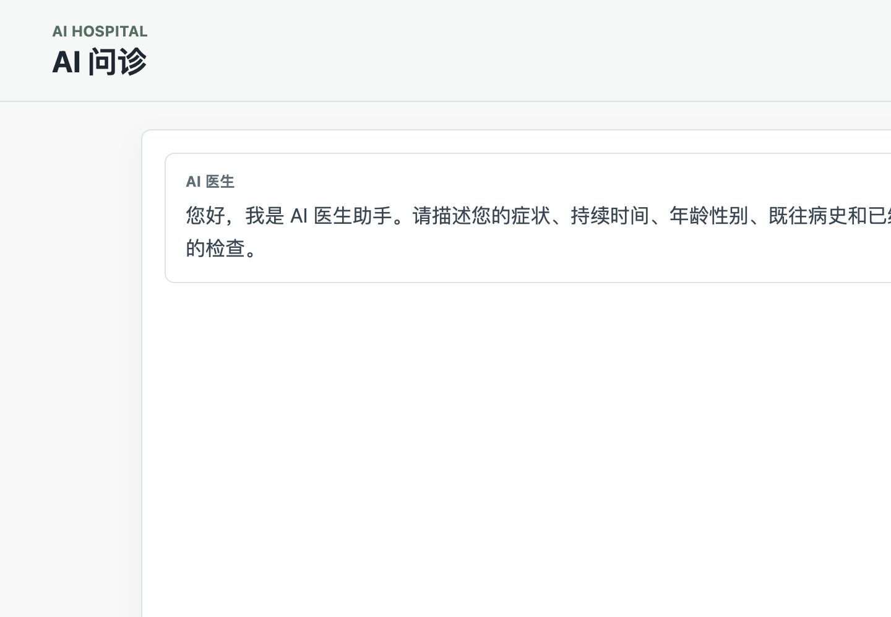
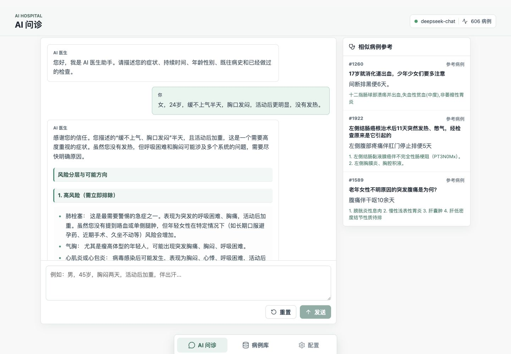
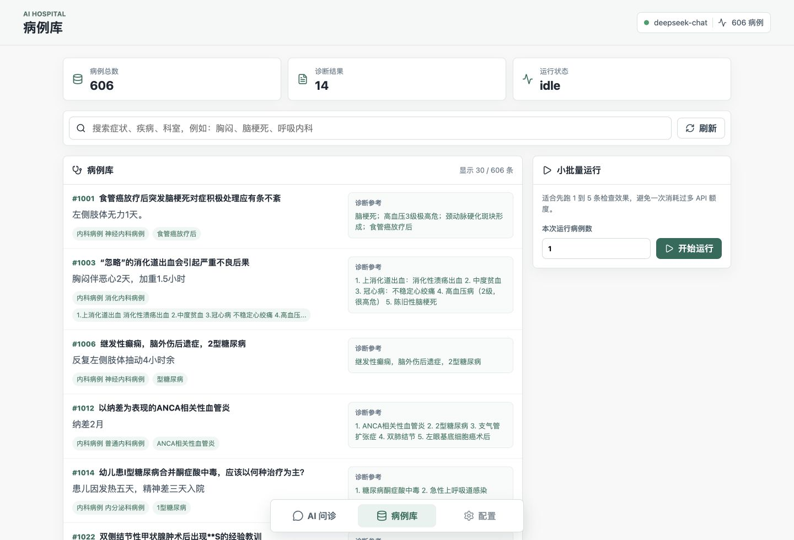
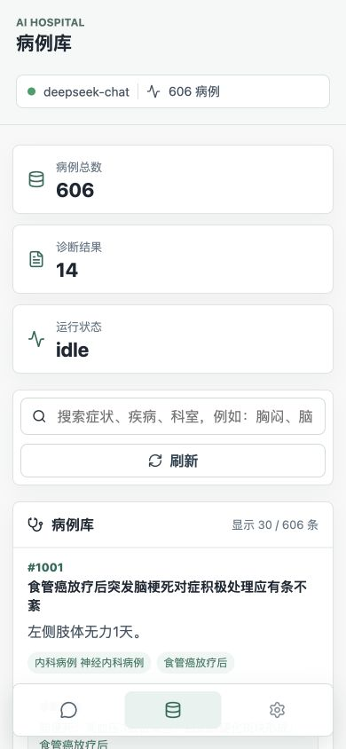

# AI Hospital

AI Hospital 是一个基于大模型的医疗问诊与病例库演示项目。当前版本包含两部分能力：

- 命令行病例诊断复现：按病例库批量运行 AI 医生问诊与诊断。
- 轻量 Web 前后端界面：支持自由输入症状、AI 医生回复、相似病例检索、病例库浏览和小批量运行。

更新时间：2026-07-13

## 1. 环境准备

在项目根目录安装 Python 依赖：

```bash
python3 -m venv .venv
.venv/bin/python -m pip install -r requirements.txt
```

Windows 下建议开启 UTF-8 模式：

```cmd
set "PYTHONUTF8=1"
python -m pip install -r requirements.txt
```

前端源码在 `web/`，如果需要重新构建前端：

```bash
cd web
pnpm install
pnpm build
```

## 2. 配置 DeepSeek API

本项目的 GPT 引擎使用 OpenAI SDK。DeepSeek 兼容 OpenAI API，因此可以复用 `OPENAI_API_KEY` 和 `OPENAI_API_BASE`。

macOS/Linux：

```bash
export OPENAI_API_KEY="你的DeepSeek_API_KEY"
export OPENAI_API_BASE="https://api.deepseek.com/v1"
export MODEL_NAME="deepseek-chat"
```

Windows：

```cmd
set "OPENAI_API_KEY=你的DeepSeek_API_KEY"
set "OPENAI_API_BASE=https://api.deepseek.com/v1"
set "MODEL_NAME=deepseek-chat"
set "PYTHONUTF8=1"
```

可以先测试 API 是否可用：

```bash
.venv/bin/python -c "from openai import OpenAI; import os; c=OpenAI(api_key=os.getenv('OPENAI_API_KEY'), base_url=os.getenv('OPENAI_API_BASE')); r=c.chat.completions.create(model='deepseek-chat', messages=[{'role':'user','content':'hi'}], max_tokens=20); print(r.choices[0].message.content)"
```

## 3. 启动 Web 问诊界面

后端会直接读取当前终端里的 `OPENAI_API_KEY`、`OPENAI_API_BASE` 和 `MODEL_NAME`。

macOS/Linux：

```bash
export OPENAI_API_KEY="你的DeepSeek_API_KEY"
export OPENAI_API_BASE="https://api.deepseek.com/v1"
export MODEL_NAME="deepseek-chat"

PYTHON_BIN=.venv/bin/python src/scripts/run_web_app.sh
```

Windows 可使用：

```cmd
set "OPENAI_API_KEY=你的DeepSeek_API_KEY"
set "OPENAI_API_BASE=https://api.deepseek.com/v1"
set "MODEL_NAME=deepseek-chat"
python -m uvicorn webapp.app:app --app-dir src --host 127.0.0.1 --port 8000
```

启动成功后打开：

```text
http://127.0.0.1:8000
```

如果终端提示 `Please set OPENAI_API_KEY`，说明当前终端没有读到 API Key，需要重新执行 `export OPENAI_API_KEY="..."` 或 Windows 的 `set "OPENAI_API_KEY=..."`。

## 4. Web 页面功能

当前轻量版有两个主要页面：

- `AI 问诊`：自由输入症状，AI 医生根据用户描述回复，并自动检索相似病例作为参考。
- `病例库`：查看已有病例库，搜索病例，查看诊断摘要，并可小批量运行病例诊断。

底部导航栏可以在两个页面之间切换。桌面端右上角会显示当前模型和病例数量，例如 `deepseek-chat`、`606 病例`。

## 5. AI 问诊用法

适合场景：

- 用户自由输入症状，例如胸闷、腹痛、头晕、发热等。
- 希望 AI 医生先做风险分层，再给出下一步就医建议。
- 想让系统自动从病例库中找相似病例作为参考。

推荐输入格式：

```text
性别，年龄，主要症状，持续时间，加重或缓解因素，伴随症状，既往病史，已做检查
```

使用步骤：

1. 进入 `AI 问诊` 页面。
2. 在底部输入框描述症状。
3. 点击 `发送`。
4. 左侧查看 AI 医生回复。
5. 右侧查看自动检索到的相似病例参考。
6. 如果想重新开始，点击 `重置`。

注意：这个界面是 AI 医生助手，不替代线下医生诊断。出现胸痛、呼吸困难、意识模糊、嘴唇发紫、严重出血等高风险症状时，应优先急诊。

### AI 问诊页初始态



### AI 问诊真实运行示例

示例输入：

```text
女，24岁，缓不上气半天，胸口发闷，活动后更明显，没有发热。
```



示例输出会包含这些部分：

- 风险分层：先判断是否可能存在需要急诊处理的情况。
- 可能方向：列出肺栓塞、气胸、心肌炎、心律失常、哮喘、焦虑等鉴别方向。
- 核心建议：明确是否建议急诊或尽快线下就诊。
- 检查建议：给出心电图、血常规、D-二聚体、胸部影像、心脏超声等可能检查。
- 病例参考：右侧展示病例库中与当前症状相似的病例。

## 6. 病例库用法

适合场景：

- 查看当前项目内置病例数据。
- 按症状、疾病、科室关键词搜索病例。
- 快速查看病例主诉和诊断参考。
- 先小批量运行 1 到 5 条病例，确认模型输出效果。

使用步骤：

1. 点击底部导航栏 `病例库`。
2. 查看顶部统计：病例总数、已有诊断结果、运行状态。
3. 在搜索框输入关键词，例如 `胸闷`、`脑梗死`、`呼吸内科`。
4. 浏览列表中的病例编号、标题、主诉、科室标签和诊断参考。
5. 右侧 `小批量运行` 中输入运行数量。
6. 点击 `开始运行`。
7. 等待状态更新，并查看诊断结果数量变化。

建议先运行 1 条病例测试，因为每次运行都会调用模型接口并消耗 API 额度。确认输出符合预期后，再逐步调大数量。

### 病例库桌面端



病例库搜索示例：

```text
脑梗死
```

预期效果：

- 病例列表数量减少。
- 与脑梗死相关的病例优先显示。
- 每条结果包含病例编号、标题、主诉、科室标签和诊断参考。

小批量运行示例：

```text
本次运行病例数：1
```

预期效果：

- 只运行少量病例，避免一次消耗过多 API 额度。
- 运行状态会从 `idle` 变为运行中状态，完成后结果数量会更新。
- 如果 API Key 没设置，页面会提示后端没有检测到 `OPENAI_API_KEY`。

### 病例库移动端



移动端保留核心统计、搜索、病例列表和底部导航，适合检查小屏幕下的主要操作是否顺畅。

## 7. 命令行病例集复现

macOS/Linux：

```bash
export OPENAI_API_KEY="你的DeepSeek_API_KEY"
export OPENAI_API_BASE="https://api.deepseek.com/v1"
export MODEL_NAME="deepseek-chat"

PYTHON_BIN=.venv/bin/python src/scripts/run_deepseek_consultation.sh
```

默认只会运行 5 条未处理病例，避免一次跑完整个病例库。需要指定数量时：

```bash
LIMIT=1 PYTHON_BIN=.venv/bin/python src/scripts/run_deepseek_consultation.sh
```

如果要完整跑完 606 条病例：

```bash
LIMIT=606 PYTHON_BIN=.venv/bin/python src/scripts/run_deepseek_consultation.sh
```

Windows：

```cmd
scripts\run_deepseek_consultation.cmd
```

Windows 指定运行数量：

```cmd
set "LIMIT=1"
scripts\run_deepseek_consultation.cmd
```

输出文件：

```text
src\outputs\dialog_history_iiyi\deepseek_consultation_dialog_history.jsonl
```

如果想停止正在运行的脚本或 Web 服务，可以在对应终端按：

```text
Control + C
```

## 8. 增加更多病例

`run.py` 期望 `--patient_database` 指向一个 JSON 数组，每个病例至少包含：

```json
[
  {
    "id": 1001,
    "profile": "患者扮演提示词",
    "medical_record": {
      "一般资料": "...",
      "主诉": "...",
      "现病史": "...",
      "辅助检查": "...",
      "诊断结果": "..."
    }
  }
]
```

常见坑：

- 文件必须是 UTF-8，最好不要带 BOM。
- 最外层必须是数组 `[...]`，不能是单个对象 `{...}`。
- `profile` 用来模拟患者回答，`medical_record` 用来给检查员/报告员查询。

新增或整理病例后，先运行格式校验：

```cmd
cd /d D:\project_code\AI_Hospital-main\src
python scripts\validate_patients.py data\patients.json
```

## 9. 常见问题

### 页面打开了，但是 AI 不回复

优先检查：

- 当前终端是否执行过 `export OPENAI_API_KEY="..."` 或 Windows 的 `set "OPENAI_API_KEY=..."`。
- `OPENAI_API_BASE` 是否是 `https://api.deepseek.com/v1`。
- `MODEL_NAME` 是否是 `deepseek-chat`。
- 后端服务是否还在运行。

### 病例库为空

检查项目数据文件是否还在，以及后端启动日志中是否读取到病例数量。当前截图中的正常状态是 `606 病例`。

### 回复格式又出现星号或断裂

这是模型输出 Markdown 不稳定导致的。当前前端已经做了清洗和格式化，如果仍然出现明显排版问题，可以继续优化 `web/src/pages/ChatPage.jsx` 的 `FormattedMessage` 解析逻辑，或进一步收紧后端 prompt。

### 运行病例会不会消耗额度

会。`AI 问诊` 和 `小批量运行` 都会调用模型接口，所以建议先用少量输入测试。病例批量运行建议从 `1` 开始。

## 10. 截图文件

本说明中的运行截图保存在：

```text
docs/assets/
```

包含：

- `docs/assets/ui-chat-desktop.png`
- `docs/assets/ui-chat-consultation-run.png`
- `docs/assets/ui-cases-desktop.png`
- `docs/assets/ui-cases-mobile.png`
